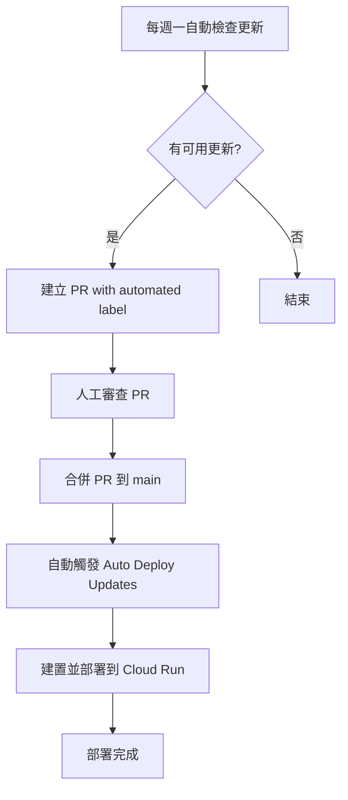

# GitHub Actions 設定指南

本專案包含自動化部署到 Google Cloud Run 的 GitHub Actions 工作流程。

## 已配置的 Actions

### 1. Deploy to Cloud Run (deploy-cloudrun.yml)

自動將應用程式部署到 Google Cloud Run。

**觸發條件：**
- 當推送到 `main` 分支且 `integrated-final/` 目錄有變更時
- 手動觸發（workflow_dispatch），可選擇強制部署

**功能：**
- 安裝依賴並建置前端
- 建置 Docker Image
- 推送到 Google Container Registry
- 部署到 Cloud Run
- 輸出部署 URL

### 2. Auto Deploy Updates (auto-deploy.yml) ⭐ 新增

自動化部署最新內容到 Cloud Run。

**觸發條件：**
- 當帶有 `automated` 標籤的 PR 合併到 `main` 分支時（如依賴套件更新）
- 手動觸發，立即部署最新內容

**功能：**
- 自動偵測依賴套件更新的 PR 合併
- 合併後立即觸發部署流程
- 提供手動觸發選項，快速部署最新內容
- 完整的建置、推送、部署流程

### 3. Auto Update Dependencies (auto-update.yml)

每週自動檢查並更新依賴套件。

**觸發條件：**
- 每週一早上 9:00 (UTC)
- 手動觸發（workflow_dispatch）

**功能：**
- 檢查過期的套件
- 自動更新 patch 和 minor 版本
- 執行建置測試
- 建立 PR 供審查

### 4. CI - Test and Lint (ci.yml)

持續整合測試和建置。

**觸發條件：**
- 任何分支推送且 `integrated-final/` 有變更
- Pull Request 建立且 `integrated-final/` 有變更

**功能：**
- 安裝依賴
- 建置專案
- 上傳建置成果

## 設定步驟

### 步驟 1：建立 GCP 服務帳號

1. 前往 [Google Cloud Console](https://console.cloud.google.com/)
2. 選擇您的專案
3. 前往「IAM 與管理」→「服務帳號」
4. 點擊「建立服務帳號」
5. 設定名稱（例如：github-actions）
6. 授予以下角色：
   - Cloud Run Admin
   - Storage Admin
   - Service Account User

### 步驟 2：建立並下載金鑰

1. 點擊剛建立的服務帳號
2. 前往「金鑰」分頁
3. 點擊「新增金鑰」→「建立新的金鑰」
4. 選擇 JSON 格式
5. 下載金鑰檔案

### 步驟 3：在 GitHub 設定 Secrets

1. 前往您的 GitHub 儲存庫
2. 點擊「Settings」→「Secrets and variables」→「Actions」
3. 點擊「New repository secret」
4. 新增以下 secrets：

#### GCP_SA_KEY
- 名稱：`GCP_SA_KEY`
- 值：貼上剛才下載的 JSON 金鑰檔案的完整內容

#### GCP_PROJECT_ID
- 名稱：`GCP_PROJECT_ID`
- 值：您的 GCP 專案 ID（例如：gen-lang-client-0093815006）

### 步驟 4：設定 Secret Manager（用於 API Key）

在 GCP 中建立 Secret：

```bash
# 建立 secret
echo -n "YOUR_GEMINI_API_KEY" | gcloud secrets create GOOGLE_API_KEY \
  --data-file=- \
  --replication-policy="automatic"

# 授予 Cloud Run 存取權限
gcloud secrets add-iam-policy-binding GOOGLE_API_KEY \
  --member="serviceAccount:YOUR_PROJECT_NUMBER-compute@developer.gserviceaccount.com" \
  --role="roles/secretmanager.secretAccessor"
```

### 步驟 5：啟用必要的 API

```bash
gcloud services enable run.googleapis.com
gcloud services enable cloudbuild.googleapis.com
gcloud services enable containerregistry.googleapis.com
gcloud services enable secretmanager.googleapis.com
```

## 使用方式

### 自動部署

#### 方式 1: 推送代碼自動部署

當您推送代碼到 `main` 分支，並且 `integrated-final/` 目錄有變更時，Actions 會自動執行部署。

```bash
git add .
git commit -m "Update application"
git push origin main
```

#### 方式 2: 依賴更新自動部署

每週自動更新會檢查並更新依賴套件，建立 PR。當您審查並合併該 PR 後，系統會自動觸發部署。

1. 等待每週一的自動更新（或手動觸發 Auto Update Dependencies）
2. 審查自動建立的 PR
3. 合併 PR
4. 系統自動部署最新版本

### 手動觸發

#### 方式 1: 手動部署最新內容（推薦）⭐

使用 **Auto Deploy Updates** workflow 快速部署最新內容：

1. 前往 GitHub 儲存庫的「Actions」分頁
2. 選擇「Auto Deploy Updates」工作流程
3. 點擊「Run workflow」
4. 確保「立即部署最新內容到 Cloud Run」選項為 true
5. 點擊「Run workflow」

這是最快速部署最新內容的方式！

#### 方式 2: 使用基本部署 workflow

1. 前往 GitHub 儲存庫的「Actions」分頁
2. 選擇「Deploy to Cloud Run」工作流程
3. 點擊「Run workflow」
4. 選擇分支並設定是否強制部署
5. 點擊「Run workflow」

## 監控部署

### 查看執行狀態

1. 前往 GitHub 儲存庫的「Actions」分頁
2. 點擊最新的工作流程執行
3. 查看各個步驟的執行狀態和日誌

### 部署成功後

部署成功後，您會在 Summary 看到：
- 服務名稱
- 部署區域
- 服務 URL
- Commit SHA

## 常見問題

### 問題 1：權限錯誤

**錯誤訊息：** `Permission denied` 或 `403 Forbidden`

**解決方法：**
- 確認服務帳號有正確的角色
- 檢查 Secret Manager 的 IAM 權限
- 確認已啟用所有必要的 API

### 問題 2：Secret 不存在

**錯誤訊息：** `Secret GOOGLE_API_KEY not found`

**解決方法：**
```bash
# 確認 secret 是否存在
gcloud secrets list

# 如果不存在，建立它
echo -n "YOUR_API_KEY" | gcloud secrets create GOOGLE_API_KEY --data-file=-
```

### 問題 3：Docker build 失敗

**錯誤訊息：** `Error building Docker image`

**解決方法：**
- 確認 Dockerfile 語法正確
- 檢查 `npm run build` 是否成功
- 查看完整的建置日誌

### 問題 4：部署超時

**解決方法：**
```yaml
# 在 workflow 中增加 timeout
jobs:
  deploy:
    timeout-minutes: 30  # 增加這行
```

## 自訂配置

### 修改部署區域

編輯 `.github/workflows/deploy-cloudrun.yml`：

```yaml
env:
  REGION: asia-northeast1  # 改為您想要的區域
```

### 修改資源配置

編輯部署步驟中的資源參數：

```yaml
- name: Deploy to Cloud Run
  run: |
    gcloud run deploy $SERVICE_NAME \
      --memory 1Gi \      # 增加記憶體
      --cpu 2 \           # 增加 CPU
      --max-instances 20  # 增加最大實例數
```

### 添加環境變數

```yaml
--set-env-vars "NODE_ENV=production,PORT=8080,CUSTOM_VAR=value"
```

## 進階功能

### 添加測試步驟

在部署前添加測試：

```yaml
- name: Run tests
  working-directory: integrated-final
  run: npm test
```

### 添加代碼檢查

```yaml
- name: Lint code
  working-directory: integrated-final
  run: npm run lint
```

### 條件部署

只在特定條件下部署：

```yaml
- name: Deploy to Cloud Run
  if: github.ref == 'refs/heads/main'
  run: |
    # 部署命令
```

## 安全性建議

1. **不要在代碼中包含敏感資訊**
   - 使用 GitHub Secrets 和 GCP Secret Manager
   - 不要提交 `.env` 檔案

2. **定期輪換金鑰**
   - 每 90 天更換服務帳號金鑰
   - 刪除舊的、未使用的金鑰

3. **限制權限**
   - 只授予必要的最小權限
   - 使用特定的服務帳號而非專案擁有者

4. **啟用稽核日誌**
   - 監控部署活動
   - 設定警報通知異常活動

## 成本控制

1. **避免不必要的部署**
   - 使用 `paths` 過濾器只在相關檔案變更時部署
   - 考慮使用分支保護規則

2. **優化建置時間**
   - 使用 npm cache
   - 使用 Docker layer caching

3. **監控使用量**
   - 定期檢查 Cloud Run 使用量
   - 設定預算警報

## 自動化部署流程

### 完整的自動化更新與部署流程

本專案現在支援完整的自動化更新與部署流程：



### 流程說明

1. **自動檢查更新**
   - 每週一早上 9:00 UTC，`auto-update.yml` 自動執行
   - 檢查 `integrated-final/` 目錄中的套件是否有更新
   - 如有更新，執行 `npm update` 並建置測試

2. **建立 PR**
   - 如果建置成功，自動建立帶有 `automated` 標籤的 PR
   - PR 標題：「🤖 自動更新依賴套件」
   - 包含詳細的更新資訊和檢查清單

3. **人工審查**
   - 開發人員審查 PR 中的變更
   - 確認沒有破壞性變更
   - 必要時進行額外測試

4. **自動部署**
   - 當帶有 `automated` 標籤的 PR 合併到 main 後
   - `auto-deploy.yml` 自動觸發
   - 完整執行建置、推送、部署流程
   - 部署最新版本到 Cloud Run

### 優勢

- ✅ **完全自動化**：從檢查更新到部署，只需審查和合併 PR
- ✅ **安全可靠**：每個步驟都有建置測試和驗證
- ✅ **即時部署**：PR 合併後立即部署，無需等待
- ✅ **手動控制**：仍保留手動觸發選項，靈活應對需求
- ✅ **清晰追蹤**：每次部署都有完整的日誌和 Summary

### 快速部署最新內容

如果您需要立即部署最新內容而不想等待自動流程：

1. 前往 Actions → Auto Deploy Updates
2. 點擊 Run workflow
3. 確保「立即部署最新內容到 Cloud Run」為 true
4. 點擊執行

系統會立即將 main 分支的最新內容部署到 Cloud Run。

## 相關文件

- [GitHub Actions 文件](https://docs.github.com/en/actions)
- [Cloud Run 文件](https://cloud.google.com/run/docs)
- [Google Cloud SDK](https://cloud.google.com/sdk/docs)
- [專案部署指南](./CLOUD_RUN_DEPLOYMENT.md)

## 需要幫助？

如果您遇到問題：
1. 查看 Actions 執行日誌
2. 檢查 Cloud Run 服務日誌
3. 在 GitHub 上開 Issue
